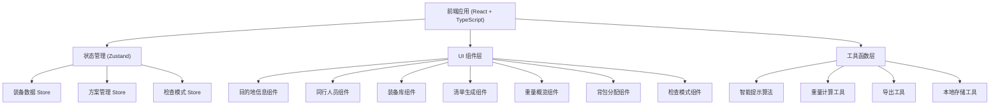

## 1. 架构设计



## 2. 技术描述

- **前端框架**：React 18 + TypeScript
- **构建工具**：Vite
- **样式方案**：Tailwind CSS 3
- **状态管理**：Zustand
- **图标库**：Lucide React
- **数据持久化**：LocalStorage
- **图表方案**：纯 CSS/SVG 实现（轻量级，无额外依赖）

## 3. 目录结构

```
src/
├── components/          # 组件目录
│   ├── DestinationInfo.tsx    # 目的地信息
│   ├── CrewMembers.tsx        # 同行人员
│   ├── GearLibrary.tsx        # 装备库
│   ├── GearList.tsx           # 清单生成
│   ├── WeightOverview.tsx     # 重量概览
│   ├── Backpack分配.tsx       # 背包分配
│   ├── SmartTips.tsx          # 智能提示
│   ├── CheckMode.tsx          # 检查模式
│   └── PlanManager.tsx        # 方案管理
├── store/               # 状态管理
│   └── useGearStore.ts        # 装备状态 store
├── data/                # 数据
│   └── gearData.ts            # 装备库数据
├── utils/               # 工具函数
│   ├── smartTips.ts           # 智能提示算法
│   ├── weightCalc.ts          # 重量计算
│   ├── exportUtils.ts         # 导出工具
│   └── storage.ts             # 本地存储
├── types/               # 类型定义
│   └── index.ts               # 类型定义
├── App.tsx              # 主应用
├── main.tsx             # 入口文件
└── index.css            # 全局样式
```

## 4. 数据模型

### 4.1 核心类型定义

```typescript
// 装备项
interface GearItem {
  id: string;
  name: string;
  category: GearCategory;
  weight: number;        // 克
  isShared: boolean;     // 是否共享装备
  isConsumable: boolean; // 是否易耗品
  description?: string;
  recommendedQty?: number; // 推荐数量（基于天数）
}

// 清单中的装备
interface ListItem extends GearItem {
  quantity: number;
  carrierId?: string;    // 携带者ID（共享装备可空）
  backpackId?: string;   // 所属背包
  checked?: boolean;     // 检查模式下是否已确认
}

// 人员
interface CrewMember {
  id: string;
  name: string;
  maxWeight: number;     // 最大承重（克）
  backpackColor: string; // 背包颜色标识
}

// 背包
interface Backpack {
  id: string;
  name: string;
  ownerId: string;
  maxWeight: number;
  color: string;
}

// 方案
interface Plan {
  id: string;
  name: string;
  createdAt: number;
  destination: {
    season: Season;
    days: number;
    weather: Weather;
    campType: CampType;
  };
  crew: CrewMember[];
  gearList: ListItem[];
  checkProgress: Record<string, boolean>;
}

// 智能提示
interface SmartTip {
  id: string;
  type: 'warning' | 'info' | 'success' | 'error';
  title: string;
  description: string;
  category?: string;
}

// 枚举类型
type GearCategory = 'tent' | 'cooking' | 'lighting' | 'firstaid' | 'clothing' | 'food' | 'other';
type Season = 'spring' | 'summer' | 'autumn' | 'winter';
type Weather = 'sunny' | 'rainy' | 'snowy';
type CampType = 'mountain' | 'lake' | 'campground' | 'desert';
```

### 4.2 状态管理

使用 Zustand 管理全局状态，包含：
- 当前方案信息（目的地、人员、装备清单）
- 装备库数据
- 检查模式状态
- 所有已保存方案列表

状态持久化到 LocalStorage。

## 5. 核心功能实现思路

### 5.1 智能提示算法
- **遗漏类别检测**：基于季节和营地类型，检查必备类别是否为空
- **重复携带检测**：检测共享装备是否被多人重复携带
- **重量超限检测**：计算总重量和个人承重，与上限比较
- **易耗品数量提示**：根据天数计算推荐数量，对比实际数量

### 5.2 重量计算
- 总重量 = Σ (装备重量 × 数量)
- 共享装备按人头分摊计算人均重量
- 分类重量统计用于图表展示

### 5.3 方案管理
- 每个方案完整保存所有配置
- 使用 LocalStorage 持久化
- 支持方案的创建、切换、删除、重命名

### 5.4 导出功能
- 导出为文本格式（便于复制）
- 支持按人导出、按类别导出
- 支持导出为 JSON 格式（可导入恢复）
